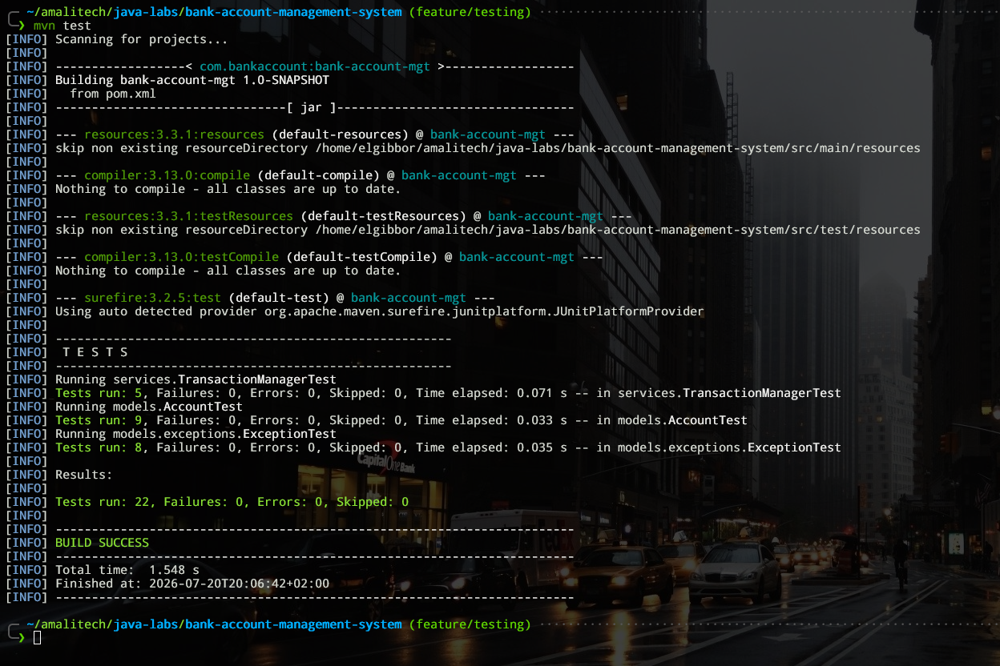
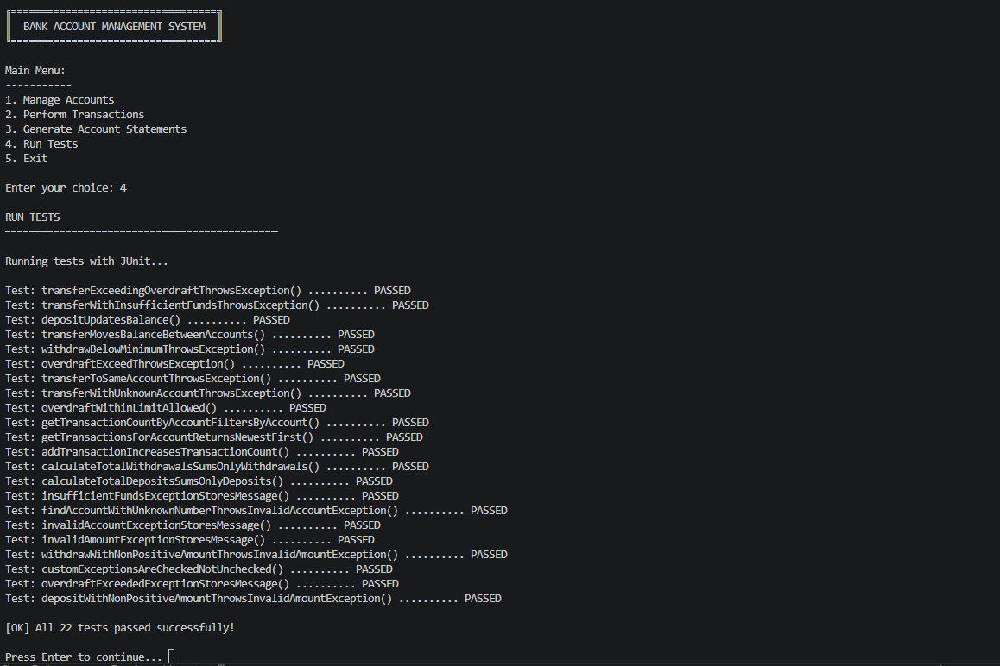

## Features

| Feature | Description |
|---|---|
| **Create Account** | Register a new account for a Regular or Premium customer |
| **View Accounts** | List all accounts with balances, plus total accounts and total bank balance |
| **Process Transaction** | Deposit or withdraw money, with a confirmation step before finalizing |
| **View Transaction History** | Show an account's transactions (newest first) with total deposits, total withdrawals, and net change |
| **Generate Account Statement** | A shorter, statement-style summary of an account's transactions and net change |
| **Run Tests** | Execute the JUnit 5 test suite from within the running application and report how many tests passed and how many failed |
| **Menu Navigation** | Looping menu, organized into Manage Accounts and Perform Transactions submenus, that keeps running until the user exits |

The application starts with five seeded demo accounts (3 Savings, 2 Checking)
so the listing has data on first launch.

### Account Types

| Type | Details |
|---|---|
| **Savings** | Interest rate 3.5% annually, minimum balance $500 (enforced on withdrawal) |
| **Checking** | No interest, overdraft limit $1,000, monthly fee $10 |

### Customer Types

| Type | Details |
|---|---|
| **Regular** | Standard banking services |
| **Premium** | Minimum balance $10,000, monthly fees waived |

## Exception Handling

Invalid conditions are reported through four custom checked exceptions rather than boolean
return values or silent failures. Each is caught in `Main` and displayed as a clear console
message instead of crashing the application.

| Exception | Thrown when |
|---|---|
| `InvalidAmountException` | A deposit, withdrawal, or transfer amount is not greater than zero |
| `InsufficientFundsException` | A withdrawal would exceed the balance, or (for a savings account) breach the $500 minimum balance |
| `OverdraftExceededException` | A checking account withdrawal would exceed the $1,000 overdraft limit |
| `InvalidAccountException` | An account number does not match any stored account, including a transfer whose source and destination are the same account |


## Requirements

- Java Development Kit (JDK) 11 or later
- Apache Maven 3.6 or later

## Build and Run

The console UI uses box-drawing characters (`╔ ═ ─`), which require a UTF-8
environment to display correctly.

> **⚠️ Do not use Windows PowerShell.** PowerShell renders the box-drawing
> characters as `?????` regardless of code page or JVM flags. Use one of the
> supported options below instead.

### Run the application from your IDE

- **IntelliJ IDEA**: open the project (IntelliJ detects `pom.xml` automatically), open
  `Main.java`, and click the **Run** button (▶)
- **VS Code** (with the Java Extension Pack): open the folder and click **Run** above
  `public static void main`

Both resolve dependencies and compile with UTF-8 automatically. This works for every menu
option **except option 4, "Run Tests"**: most IDE run configurations only put the main output on
the classpath, not the compiled test classes, which is what a `ClassNotFoundException` for a
test class at that point means. Use the command below for that option instead.

### Run the application from the command line, including option 4

From this directory:

```bash
mvn test-compile exec:java
```

This compiles both main and test sources, then runs `Main` with the main output, the compiled
test classes, and every dependency on the classpath together, so every menu option, including
"**Run Tests**," works regardless of which IDE, if any, is being used. This is also the most
reliable way to run the application, and the one to use for option 4 specifically.

---

## Testing

The JUnit 5 suite covers valid and invalid cases for `deposit`, `withdraw`, and `transfer`,
including that each custom exception is thrown under the correct condition, plus
`TransactionManager`'s recording and per-account querying of transactions.

| Test class | Covers |
|---|---|
| `AccountTest` | `Account.deposit` and `Account.withdraw`, and `AccountManager.transfer`, valid and invalid cases, for both account types |
| `TransactionManagerTest` | Recording transactions, filtering and summing them by account and type, newest-first ordering |
| `ExceptionTest` | The four custom exception classes' own contract, plus exception conditions not otherwise covered |

Run them with `mvn test`, or from within the running application via menu option 4, "Run
Tests," which executes the same suite through the JUnit Platform Launcher and prints a
per-test result line followed by a summary.

### Test results

As of the current commit, all 22 tests pass, with no failures, errors, or skips:

| Test class | Tests | Passed |
|---|---|---|
| `AccountTest` | 9 | 9 |
| `TransactionManagerTest` | 5 | 5 |
| `ExceptionTest` | 8 | 8 |
| **Total** | **22** | **22** |

Output from `mvn test`, run on `feature/testing`:



Output from the console's own "Run Tests" option (menu option 4), which runs the same suite
through the JUnit Platform Launcher rather than through Maven:



(The order tests print in can vary between runs, since JUnit does not guarantee execution
order across test classes; the pass count does not.)

---

## Git Workflow

Phase Two was built across four branches (`feature/refactor`, `feature/exceptions`,
`feature/testing`, off `main`), including a deliberate `git cherry-pick` of the refactor
branch's commits into the exceptions branch, with real conflicts resolved by hand. See
[`docs/git-workflow.md`](docs/git-workflow.md) for the full branch history, the cherry-pick
commands used, and the reasoning behind each conflict resolution.

---

## Usage

At the main menu, enter the number of the option you want:

```
1. Manage Accounts
2. Perform Transactions
3. Generate Account Statements
4. Run Tests
5. Exit
```

- **Manage Accounts**, then **Create Account**: enter the customer's name, age, contact, and
  address, then choose the customer type (Regular or Premium), account type
  (Savings or Checking), and an initial deposit.
- **Manage Accounts**, then **View All Accounts**: list every account with its balance and
  type-specific details.
- **Perform Transactions**, then **Process Transaction**: enter an account number, choose
  Deposit or Withdrawal, enter an amount, then confirm with `Y` to finalize (or `N` to
  cancel; a cancelled transaction leaves the balance unchanged).
- **Perform Transactions**, then **View Transaction History**: enter an account number to see
  its transactions and summary totals.
- **Generate Account Statements**: enter an account number for a shorter, totals-focused
  summary of its transactions.
- **Run Tests**: runs the JUnit 5 suite from within the application. See
  [Testing](#testing) below for what it covers and current results.

Invalid input is handled gracefully: non-numeric menu choices and amounts are rejected and
re-prompted instead of crashing, and business-rule violations (a non-positive amount, an
unknown account number, a savings withdrawal breaching the $500 minimum, a checking
withdrawal exceeding the overdraft limit) are reported as clear error messages rather than
crashing the application.

## Project Structure

```
bank-account-management-system/
├── pom.xml
├── docs/
│   └── git-workflow.md
├── src/
│   ├── main/java/
│   │   ├── Main.java
│   │   ├── models/                  Account, Customer hierarchies, Transaction, Transactable
│   │   │   └── exceptions/          The four custom exceptions
│   │   ├── services/                AccountManager, TransactionManager, StatementGenerator
│   │   └── utils/                   TableFormatter
│   └── test/java/                   Mirrors the package layout above
│       ├── models/AccountTest.java
│       ├── models/exceptions/ExceptionTest.java
│       └── services/TransactionManagerTest.java
```