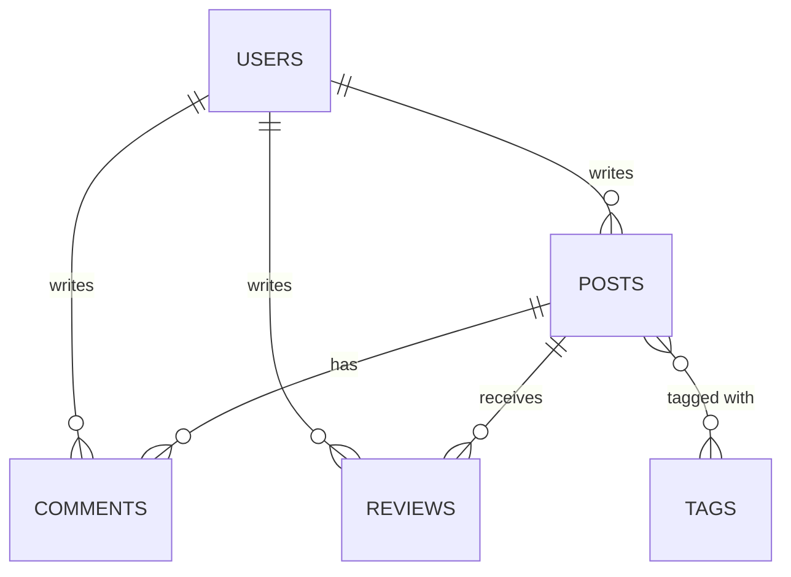
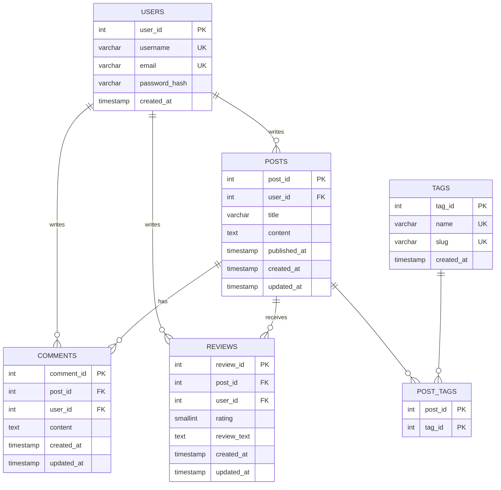

# Database Design Document

I'm building this on a relational paradigm, PostgreSQL specifically, for the entire core
system. I am treating Comments and Reviews as unstructured content and will design a
document schema for one of them as a comparison deliverable.

Reviews are modeled as distinct from Comments. A Review is a structured evaluation of a
Post, a numeric rating from one to five plus optional text. A Comment is free text discussion
with no rating. This gives Reviews a real reason to exist as its own entity rather than a
renamed Comment.

A user may only leave one review per post, enforced with a composite
unique constraint on the Reviews table.

## Conceptual model

Entities and relationships only.

## Logical and physical model

Attributes, primary keys, foreign keys, data types, and the junction table that resolves the
Posts to Tags many to many relationship.

## Constraints the diagram cannot show on its own

Single column uniqueness are marked with UK, but it has no notation for a uniqueness rule
spanning more than one column, so I am recording these here in words.

- Reviews needs `UNIQUE(post_id, user_id)`, one review per user per post.
- Reviews.rating needs `CHECK (rating BETWEEN 1 AND 5)`, since PostgreSQL has no TINYINT to
  lean on for range enforcement the way MySQL sometimes gets used for.
- Post_Tags has no unique constraint of its own beyond its composite primary key,
  `(post_id, tag_id)` together already prevent the same tag being attached to the same post
  twice.
