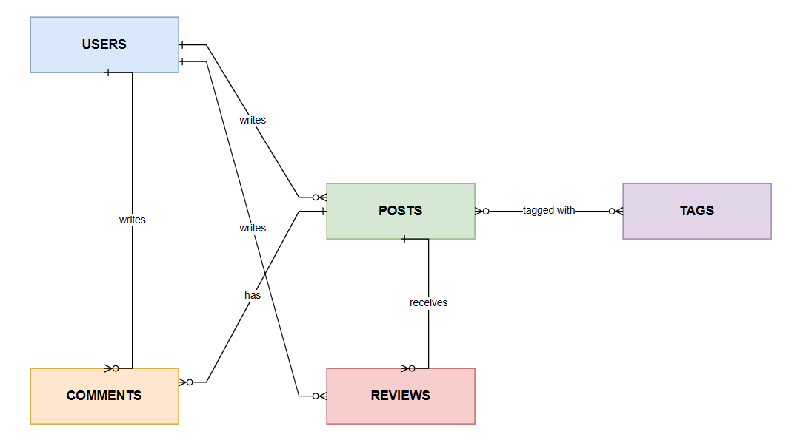
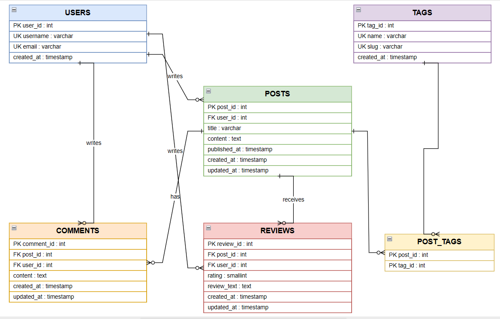

# Database Design Document

I'm building this on a relational paradigm, PostgreSQL specifically, for the entire core
system. Comments and Reviews are treated as unstructured content and a document schema
is designed for one of them as a comparison deliverable.

Reviews are modeled as distinct from Comments. A Review is a structured evaluation of a
Post, a numeric rating from one to five plus optional text. A Comment is free text discussion
with no rating. This gives Reviews a real reason to exist as its own entity rather than a
renamed Comment.

A user may only leave one review per post, enforced with a composite
unique constraint on the Reviews table.

## Conceptual model

Entities and relationships only, no attributes, no keys.

## Logical and physical model

Attributes, primary keys, foreign keys, data types, and the junction table that resolves the
Posts to Tags many to many relationship.

## Constraints the diagram cannot show on its own

Single column uniqueness are marked with UK, but it has no notation for a uniqueness rule
spanning more than one column, so I am recording these here in words.

- Reviews needs `UNIQUE(post_id, user_id)`, one review per user per post.
- Reviews.rating needs `CHECK (rating BETWEEN 1 AND 5)`, since PostgreSQL has no TINYINT to
  lean on for range enforcement the way MySQL sometimes gets used for.
- Post_Tags has no unique constraint of its own beyond its composite primary key,
  `(post_id, tag_id)` together already prevent the same tag being attached to the same post
  twice.

## Indexes

I am indexing exactly the columns the specification names as frequently queried.

- `posts.title`, for keyword search.
- `posts.user_id`, for looking up an author's posts.
- `tags.name`, for looking up a tag by name.

## Referential integrity

Every foreign key needs an explicit deletion behavior rather than relying on a default.

- Comments, Reviews, and Post_Tags use `ON DELETE CASCADE` when their parent Post is deleted,
  a comment or review with no post to attach to has no reason to exist.
- Post_Tags also uses `ON DELETE CASCADE` when its parent Tag is deleted.
- Posts.user_id, Comments.user_id, and Reviews.user_id use `ON DELETE RESTRICT`, deleting a
  user should not silently erase everything they authored, that has to be a deliberate,
  separate decision, not an automatic side effect.

## Analytics queries

The Analytics screen ([`AnalyticsDao`](../src/main/java/dao/AnalyticsDao.java)) runs four
read only aggregate reports, each grouping across a foreign key rather than filtering by a
single column:

- Most commented posts: `posts` LEFT JOIN `comments`, grouped by post, ordered by comment count.
- Highest rated posts: `posts` JOIN `reviews`, grouped by post, ordered by average rating (an
  inner join, not a left one, since a post with no reviews has nothing to average).
- Most used tags: `tags` LEFT JOIN `post_tags`, grouped by tag, ordered by how many posts use it.
- Most active authors: `users` LEFT JOIN `posts`, grouped by user, ordered by post count.

