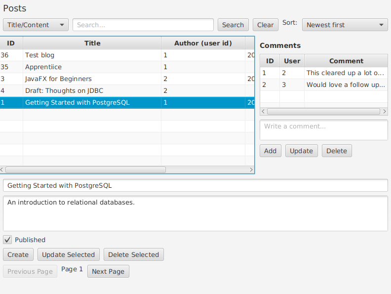
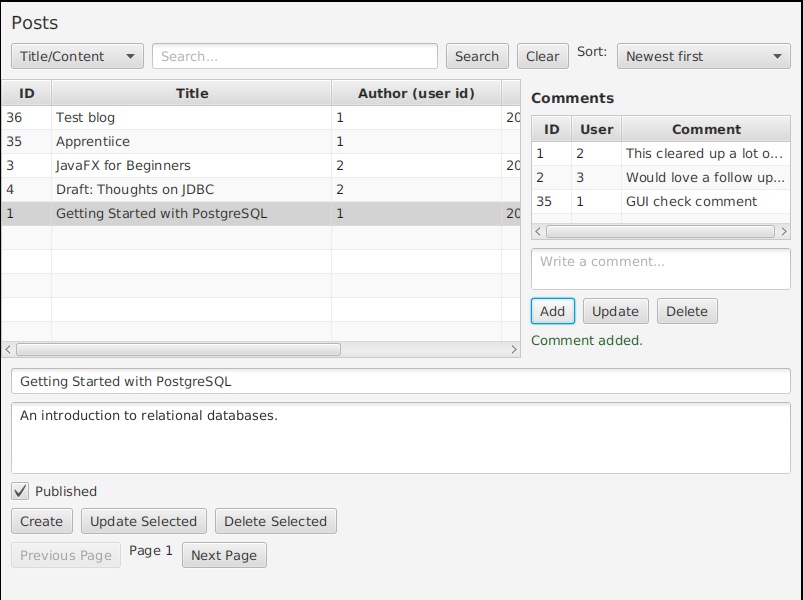
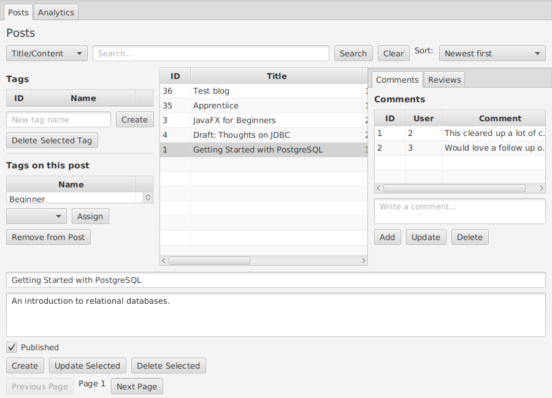
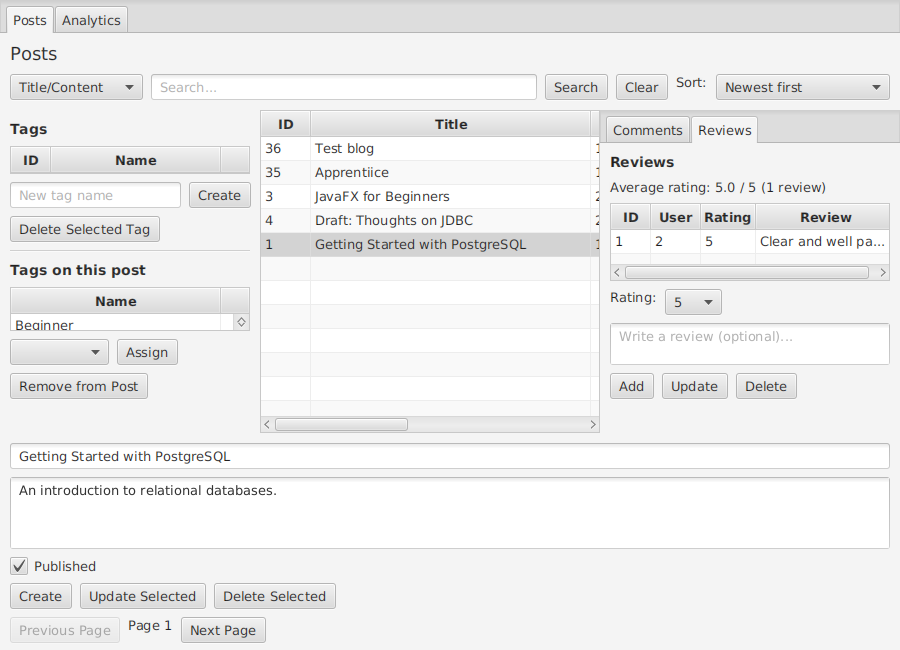
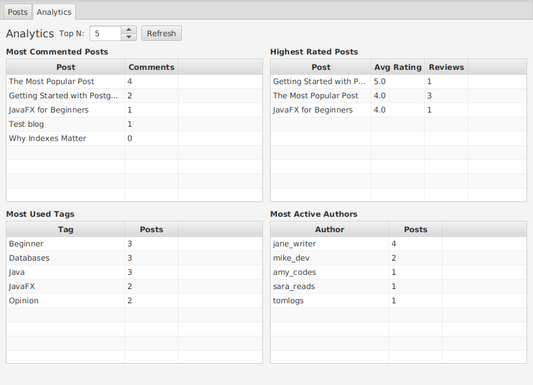

# Testing Evidence

I have two layers of evidence here. Automated JUnit tests cover the Service and DAO
layers, and screenshots cover the JavaFX layer, since a plain JUnit test never opens a
window and cannot click a button.

## Automated tests

`src/test/java/service/` holds one JUnit class per service, `PostServiceTest`,
`CommentServiceTest`, `TagServiceTest`, `ReviewServiceTest`, and `AnalyticsServiceTest`. All
five run against the real PostgreSQL database this application actually uses, the same one
configured in `db.properties`, not a mock. That was a deliberate choice, consistent with how
every feature in this project was verified while building it, real SQL, real constraints,
real query results, not a simulation of them.

Every test that writes a row deletes it again before finishing. `AnalyticsServiceTest` is the
one exception, its reports are read only.
Running `mvn test` gives this:

```
[INFO] Running service.ReviewServiceTest
[INFO] Tests run: 8, Failures: 0, Errors: 0, Skipped: 0, Time elapsed: 0.795 s -- in service.ReviewServiceTest
[INFO] Running service.PostServiceTest
[INFO] Tests run: 17, Failures: 0, Errors: 0, Skipped: 0, Time elapsed: 0.472 s -- in service.PostServiceTest
[INFO] Running service.TagServiceTest
[INFO] Tests run: 8, Failures: 0, Errors: 0, Skipped: 0, Time elapsed: 0.309 s -- in service.TagServiceTest
[INFO] Running service.AnalyticsServiceTest
[INFO] Tests run: 5, Failures: 0, Errors: 0, Skipped: 0, Time elapsed: 0.098 s -- in service.AnalyticsServiceTest
[INFO] Running service.CommentServiceTest
[INFO] Tests run: 8, Failures: 0, Errors: 0, Skipped: 0, Time elapsed: 0.195 s -- in service.CommentServiceTest
[INFO]
[INFO] Results:
[INFO]
[INFO] Tests run: 46, Failures: 0, Errors: 0, Skipped: 0
[INFO]
[INFO] BUILD SUCCESS
```

Between the five classes, this covers creating, reading, updating, and deleting posts,
comments, tags, and reviews; validation rejecting blank or oversized input and an
out-of-range rating; a foreign key violation being translated into a readable message; a
unique constraint violation being translated the same way for a duplicate tag name, a
duplicate tag assignment, and a second review from the same user on the same post; search
returning the right rows case insensitively; sorting by title and by published date, drafts
sorting last; the cache correctly recording a miss on the first call, a hit on the second,
and a fresh miss again after a write invalidates it.

Running `mvn test` requires a configured `db.properties`, the same requirement as running
the application itself.

## JavaFX interface



Selecting "Getting Started with PostgreSQL" loads its two seeded comments into the panel
on the right, confirming `PostController` and `CommentController` are wired together
correctly through `fx:include`.



Typing into the comment field and pressing Add appends the new comment and shows
"Comment added.", confirming the create path works end to end, from a real button click
down to a real row in the database. I then deleted that comment the same way and
confirmed the database returned to its original state, so this check left no residue.



The same selection now also drives `TagController`, on the left. "Getting Started with
PostgreSQL" is seeded with three tags; "Beginner" is the one currently scrolled into view.
The "Tags on this post" table, the "Assign" combo box, and the "Remove from Post" button are
all reading and writing through `TagService` and the `post_tags` junction table, not a copy
of the data held anywhere else.



Clicking the "Reviews" tab next to "Comments" loads that post's one seeded review and shows
"Average rating: 5.0 / 5 (1 review)", confirming `ReviewController` and
`ReviewService.getAverageRating` compute that figure from the real `reviews` table rather
than a hardcoded label.



The Analytics tab, reachable from the tab bar `MainController` adds above the Posts screen,
runs all four `AnalyticsDao` reports against the live database. "The Most Popular Post"
correctly tops "Most Commented Posts" with 4 comments, "Getting Started with PostgreSQL"
correctly tops "Highest Rated Posts" at 5.0 from its one review, and the tag and author
counts match what `db/seed.sql` assigns, confirming the joins and `GROUP BY` queries behind
this screen are reading real rows, not placeholder data.
